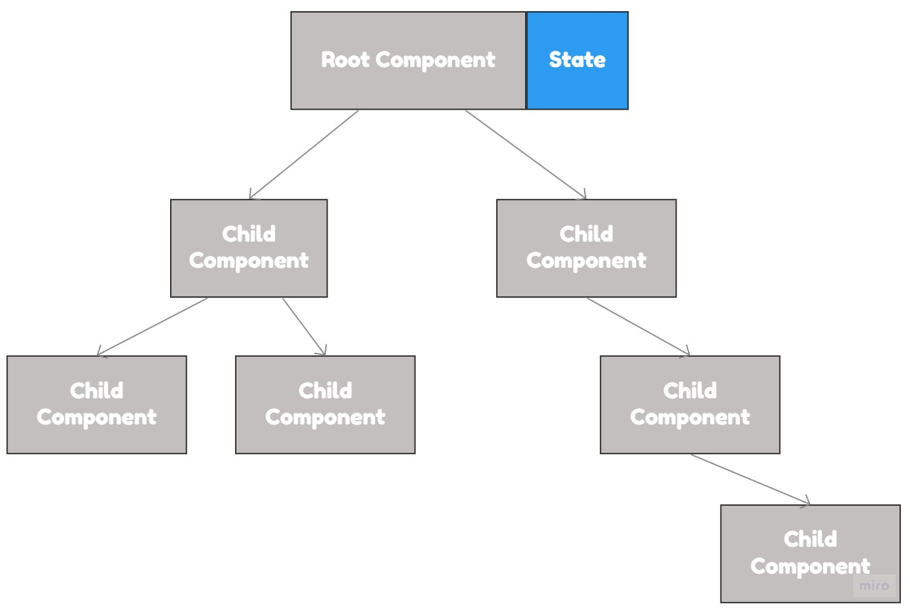
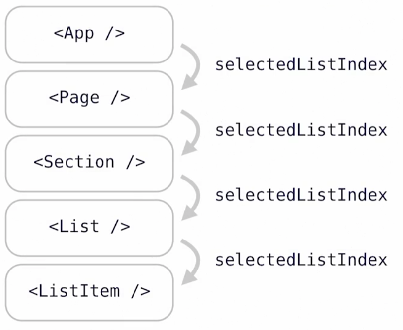
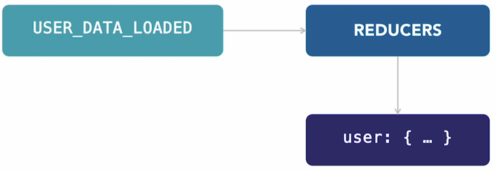
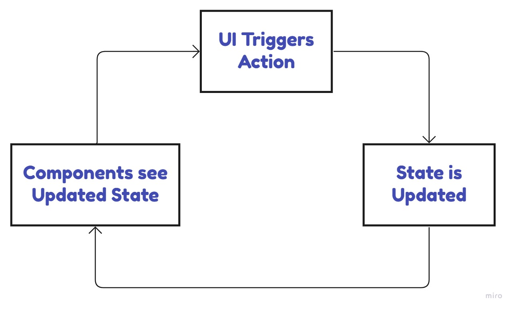

# Redux

<details>
  <summary>If State Management Tool (such as <code>Redux</code>) is not used. (Click) </summary>

### A Single State
<p align="center">
    
</p>

 * ### Props Drilling
    <p align="center">
        
    </p>

### Components Managing Their Own State
<p align="center">
    
</p>

</details>

## The Redux Store
<p align="center">
    
</p>

Redux is a global state (`Store`) with ***strict rules*** (these rules enforced by something called `Actions` and processed by `Reducers` and update the `Store`)

Example Redux Store:
```json
{
    currentUser: {
        isLoggedIn,
        username,
        name,
        age,
        bio
    }
    users: { ... },
    products: [ ... ],
    articles: [ ... ]
    ...
}
```

## Redux Actions
Redux Actions - are json objects consisting of two things, `type` (naming the action), and `payload` (additional data)

Example of Redux Actions: 
1. type: `USER_DATA_LOADED` with payload: the actual user data fetched from server
2. type: `ITEM_ADDED_TO_CART` with payload: the id of the item that users added to their shopping cart

## Redux Reducers
Redux's way of specifying what should happen to our `Redux Store` (central state), when a given **action** occurs.

<p align="center">
    
</p>

## Unidirectional Data Flow

<p>
    
</p>

> <h3>Components can only interact with the state by triggering Redux actions</h3>


