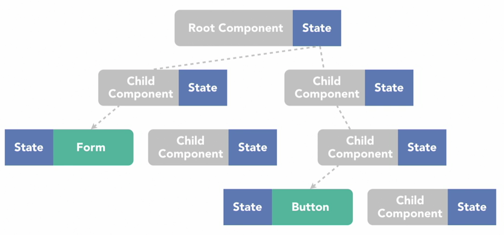
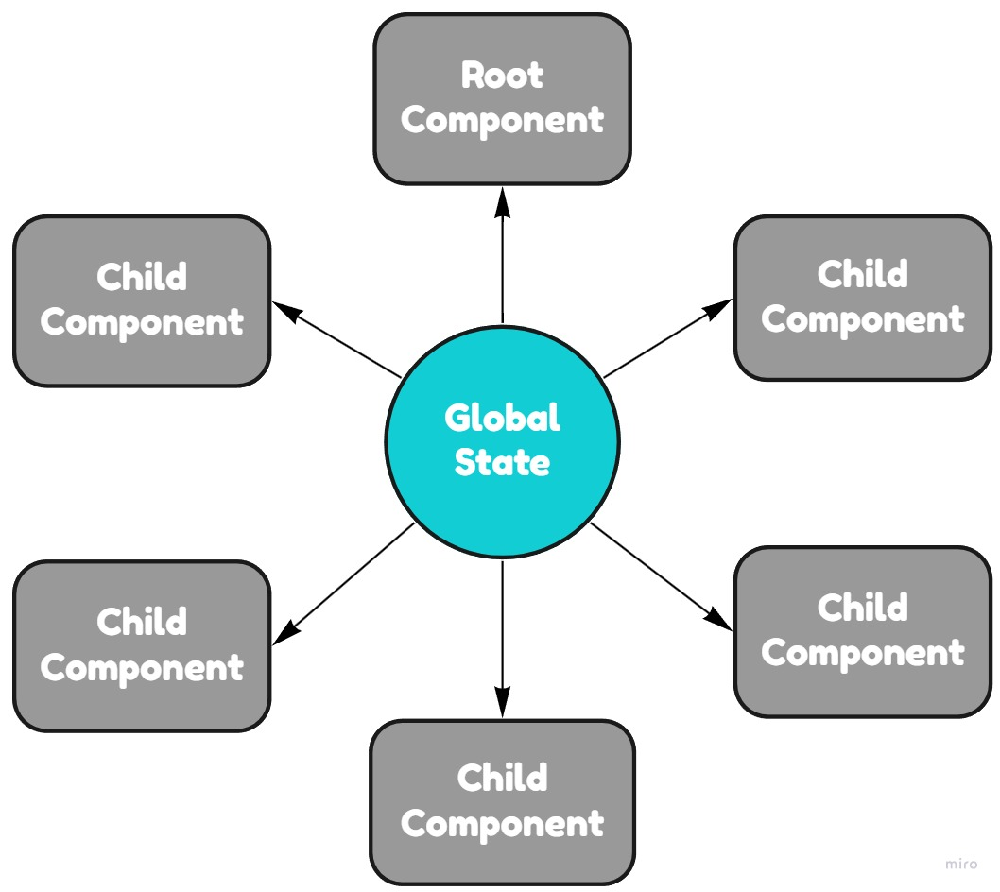
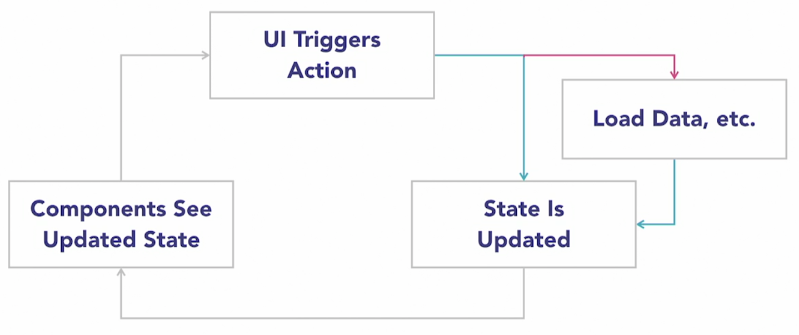
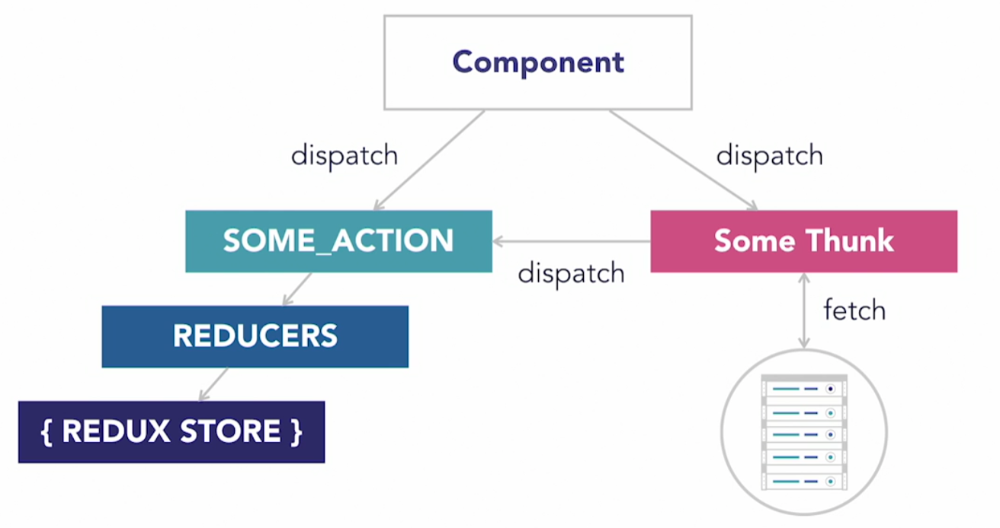
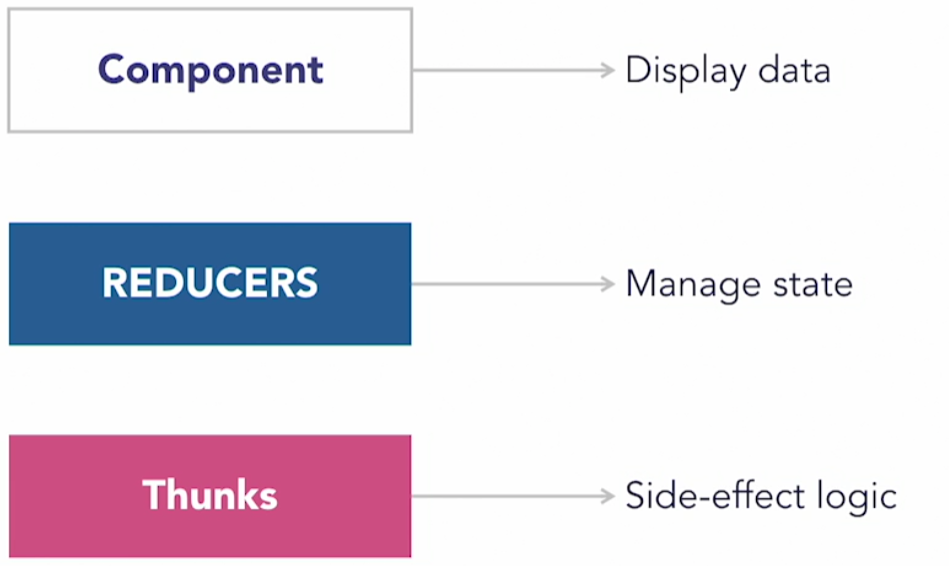

# Redux

<details>
    <summary>Redux</summary>

<details>
  <summary>If State Management Tool (such as <code>Redux</code>) is not used. (Click) </summary>

### A Single State
<p align="center">
    
</p>

 * ### Props Drilling
    <p align="center">
        
    </p>

### Components Managing Their Own State
<p align="center">
    
</p>

</details>

## The Redux Store
<p align="center">
    
</p>

Redux is a global state (`Store`) with ***strict rules*** (these rules enforced by something called `Actions` and processed by `Reducers` and update the `Store`)

Example Redux Store:
```json
{
    currentUser: {
        isLoggedIn,
        username,
        name,
        age,
        bio
    }
    users: { ... },
    products: [ ... ],
    articles: [ ... ]
    ...
}
```

## Redux Actions
Redux Actions - are json objects consisting of two things, `type` (naming the action), and `payload` (additional data)

Example of Redux Actions: 
1. type: `USER_DATA_LOADED` with payload: the actual user data fetched from server
2. type: `ITEM_ADDED_TO_CART` with payload: the id of the item that users added to their shopping cart

## Redux Reducers
Redux's way of specifying what should happen to our `Redux Store` (central state), when a given **action** occurs.

<p align="center">
    
</p>

## Unidirectional Data Flow

<p>
    
</p>

> <h3>Components can only interact with the state by triggering Redux actions</h3>

</details>

---

# Redux Thunk

<details>
    <summary>Redux Thunk</summary>

> Even with Redux in place the components still have to contain the logic for doing all the asynchronous operations, such as fetching or updating server data. These sorts of operations are called <b><code>side effects</code></b>

### Redux Thunk Work Flow
<p align="center">
    
</p>

<p align="center">
    
</p>

```js
        // instead of passing action to dispatch for example:
            dispatch({ type, action });

        // with redux thunk you can pass a asynchronous function
            dispatch(async () => {
                ...
                dispatch(loadUserSuccess(user));    // dispatches action
                dispatch(loadVideos());             // dispatches action
                dispatch(async () => { ... });      // dispatches thunk
            });
```

<p align="center">
    
</p>

</details>
